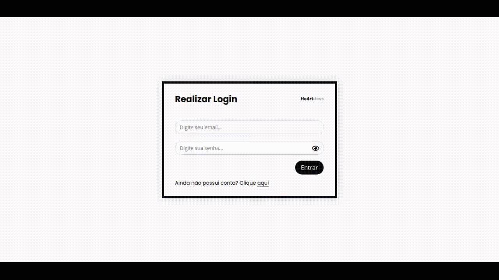

<h1 align="center">Formulário Único - He4rtlabs Challenges</h1>

Este projeto faz parte da resolução do desafio desenvolvido pelo grupo He4rt Developers. <a href="https://github.com/he4rt/heartlabs-challenges">Entenda mais sobre</a>.

<h3 align="center"> 🚧 Em construção ... 🚧</h3>

<h3>🚀 O Desafio</h3>
- Criar um frontend com dois formulários com transição suave entre eles, criando um efeito como se fosse o mesmo formulário.
- Desenvolver o backend com integração de login e registro.
- <a href="https://github.com/he4rtlabs/he4rtlabs-challenges-03">Veja mais sobre o desafio.</a>

<h3>👩‍💻  Resultado</h3>

<h3>⚙️ Tecnologias usadas</h3>
- HTML 5
- CSS 3
- JavaScript

### To do list
- [x] Frontend.
- [x] Válidação dos campos de email e senha.
- [ ] Backend.
